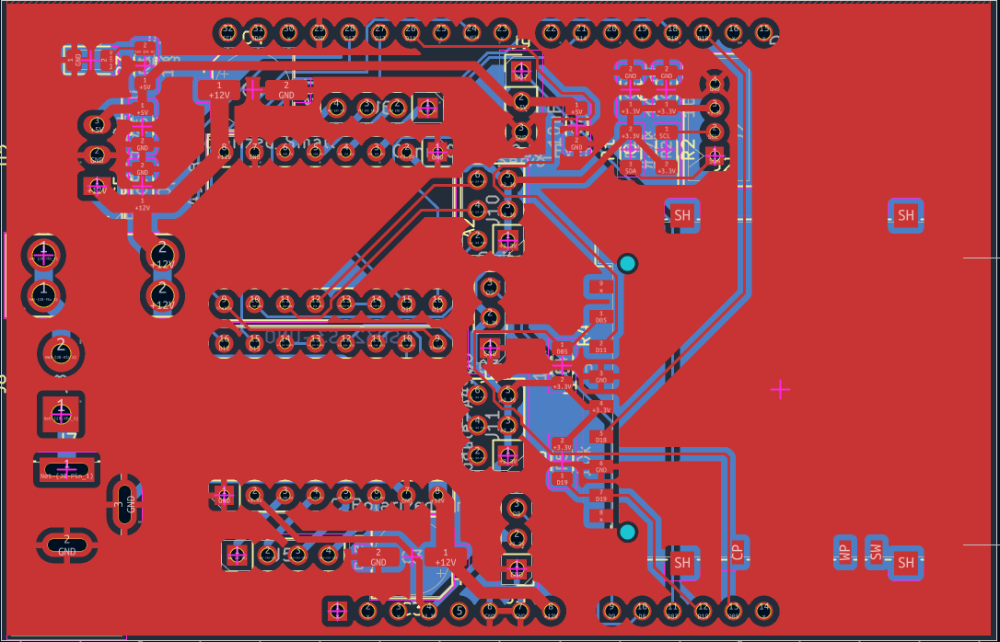
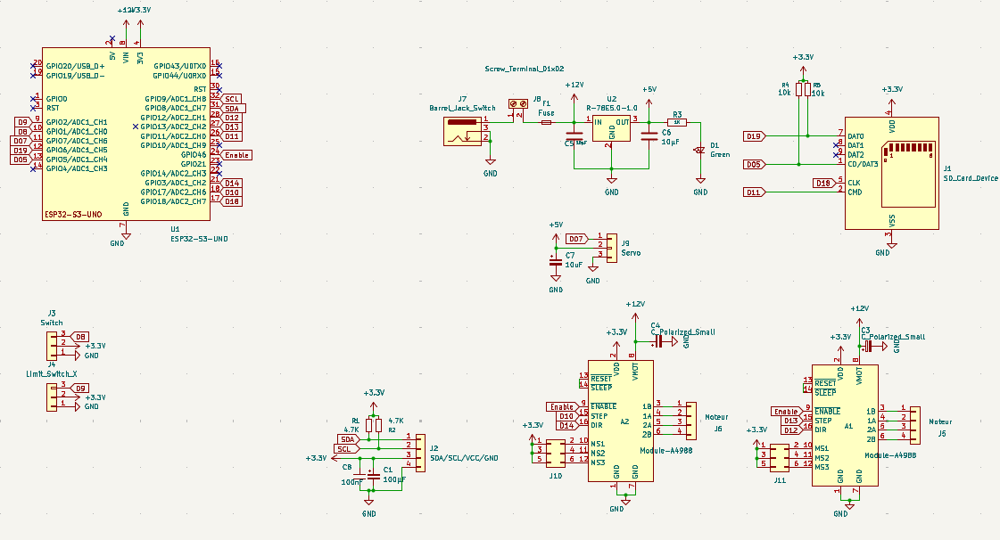
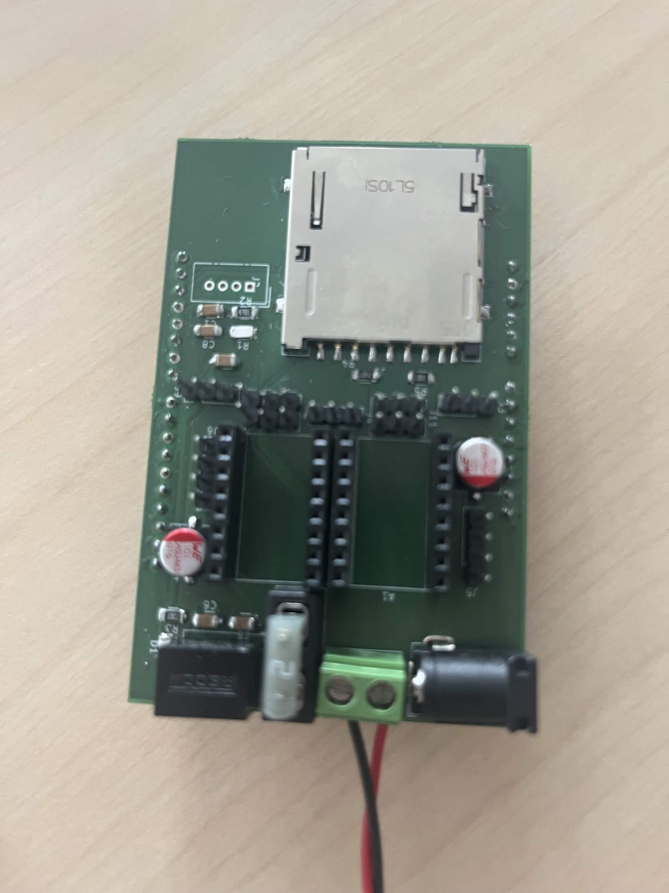
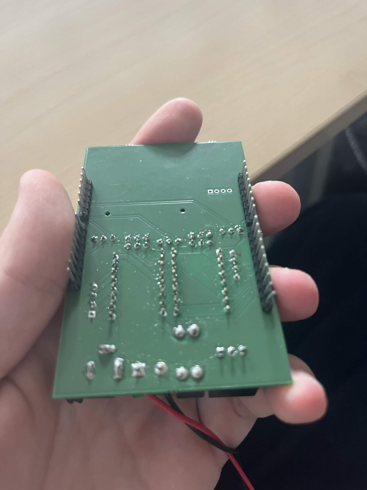
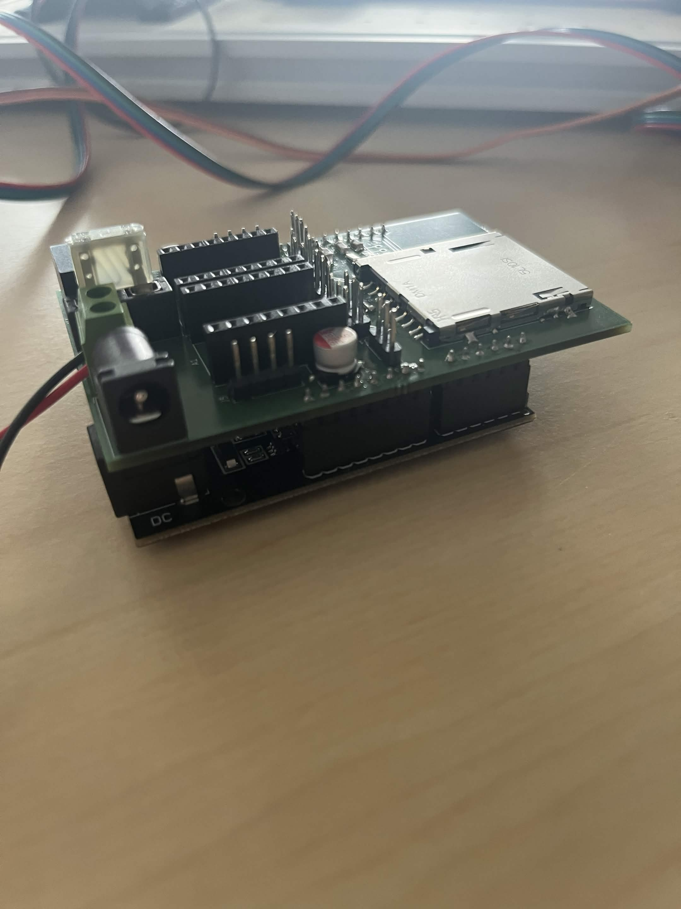
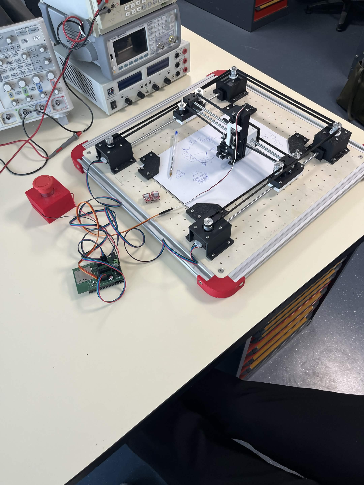

Ce projet s’inscrit dans la continuité du projet Machine That Draws que vous avez réalisé précédemment. L’objectif est de concevoir et fabriquer une carte électronique dédiée pour remplacer le contrôleur de drivers.

La carte intégrera :

- ESP32 comme microcontrôleur principal
- 2 drivers A4988 pour piloter les moteurs pas-à-pas X et Y
- Lecteur de carte SD pour stocker les fichiers G-code ou dessins
- Écran OLED pour afficher l’état, les menus et la progression
- Connecteurs pour moteurs, alimentation et extension
- Gestion des alimentations

Voici le PCB de notre carte électronique :

Mais également le schématique :

Voici le test de l'écran :

<video width="50%" height="50%" controls>
        <source src="../images/videotestecrans.mp4" type="video/mp4" />
</video>

Nous avons ensuite soudé la carte :

Et nous l'avons ensuite mise sur notre machine :

